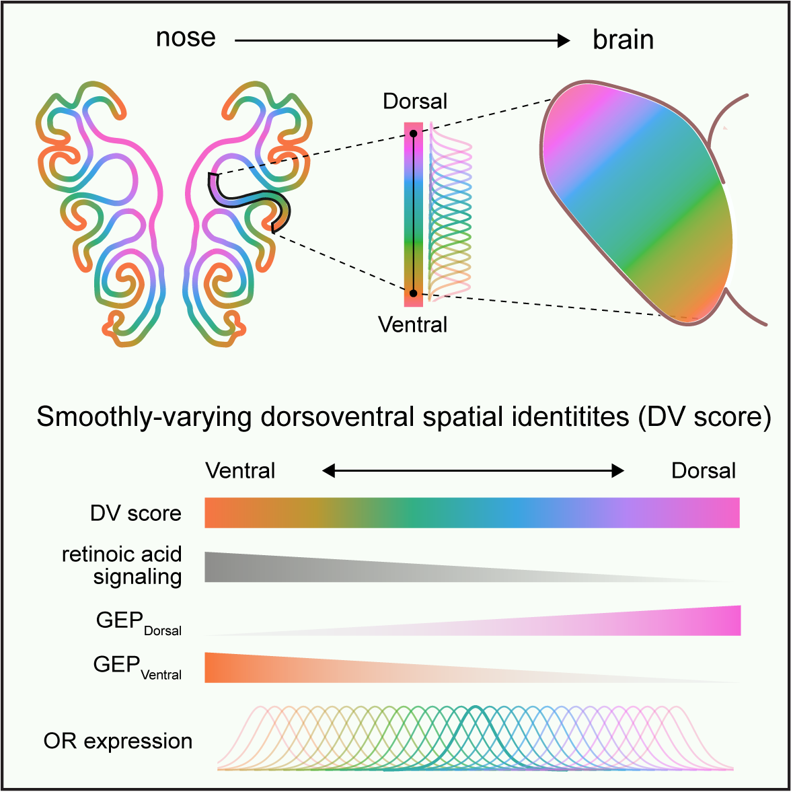

# Brann_olfactory_dorsoventral
==============================

# A spatial code governs olfactory receptor choice and aligns sensory maps in the nose and brain

## Summary

Although topographical maps organize many peripheral sensory systems, mouse olfactory sensory neurons (OSNs) are thought to randomly choose which one of 1,100 possible olfactory receptors (ORs) to express, with spatial organization in the olfactory epithelium limited to a handful of broad anatomical zones that modestly restrict OR choice. Here we reveal that each OR is instead expressed at a unique mean dorsoventral position, thereby instantiating a stereotyped receptor map in the olfactory epithelium. OSN dorsoventral identities are encoded by a coherent gene expression program, which includes key transcription factors and axon guidance molecules; use of this program reflects a dorsoventral gradient in retinoic acid signaling, translates each physical location into a spatially appropriate distribution of potential OR choices, and aligns receptor maps in the nose and brain. Spatial order in the olfactory system, therefore, arises from a continuously varying transcriptional code that precisely organizes the many discrete channels responsible for smell.

## Manuscript

For more details, please see our Open Access manuscript [here](https://doi.org/10.1101/2025.05.02.651738).

# Installation

## Requirements 

1. Create a new conda environment. `conda create -n dv_score python=3.9`
2. Activate that env `conda activate dv_score`.
3. Clone and enter this repo: `git clone git@github.com:dattalab/Brann_olfactory_dorsoventral.git && cd Brann_olfactory_dorsoventral`
4. To install the specific versions of packages used when this repo was created do `pip install -r requirements.txt`. For example, the code requires one to `pip install numpy seaborn scikit-learn jupyter notebook`. The scripts also rely on `pip install pysam scanpy`, and plotting functions in the notebooks rely on `pip install cmcrameri cmocean textalloc`
5. Install the code in this directory via `pip install -e .`

## Data
1. Processed sequencing data is available on the NCBI GEO at Accession numbers [GSE297068](https://www.ncbi.nlm.nih.gov/geo/query/acc.cgi?acc=GSE297068) and [GSE173947](https://www.ncbi.nlm.nih.gov/geo/query/acc.cgi?acc=GSE173947). Raw fastq files can be found on the SRA (accessions SRP583999 & SRP318630).
2. Data were preprocessed by running the Nextflow [pipeline](scripts/nextflow_pipeline.nf) in the scripts folder.
3. The code and additional preprocessed data files are hosted on Zenodo:
. For preprocessed files (e.g. `.parquet` files), one can download them and add them to the [from_zenodo](data/processed/from_zenodo/) folder.
4. Additional instructions for how to work with the raw data and to work with the olfactory gene expression programs (GEPs) can be found in the following GitHub repo: [Tsukahara_Brann_OSN](https://github.com/dattalab/Tsukahara_Brann_OSN).

# Examples
Code to generate key results, focusing on the dorsoventral (DV) score.

1. Open a new jupyter notebook with `jupyter notebook`.
2. Run the [notebooks](./notebooks). 
3. Additional stand-alone [scripts](./scripts) demonstrate the [Nextflow](https://nextflow.io/) pipelines that were used to uniformly preprocess scRNA-seq data, the [scVI](https://scvi-tools.org/) and scANVI models that were used for data integration, and other data preprocessing and analysis steps.

# Contact
For more details, please post an issue here or contact the authors.